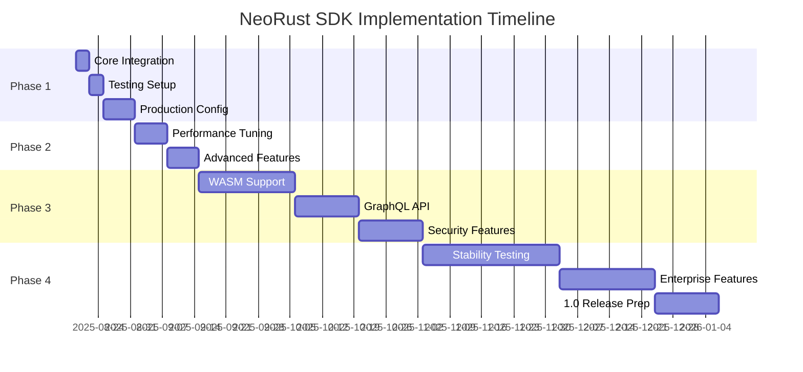

# NeoRust SDK Implementation Roadmap

## Executive Summary

This roadmap outlines the implementation strategy for adopting NeoRust SDK v0.4.4's new features and planning for future enhancements through v1.0.0.

## Current State (v0.4.4)

### Completed Features ✅
- Real-time gas estimation via RPC
- Token bucket rate limiting
- Property-based testing framework
- Code coverage CI/CD pipeline
- Production client with enterprise features
- Comprehensive documentation suite
- Security audit (95/100 score)

### Production Readiness: 99%

## Implementation Phases

## Phase 1: Immediate Adoption (Week 1-2)

### Priority 1: Core Integration
**Timeline**: Days 1-3

1. **Update Dependencies**
   ```toml
   neo3 = "0.4.4"
   proptest = "1.5"
   ```

2. **Migrate Clients**
   - Replace basic RpcClient with ProductionRpcClient
   - Enable rate limiting (standard preset)
   - Configure connection pooling

3. **Implement Gas Estimation**
   - Replace fixed gas values with real-time estimation
   - Add 15-20% safety margins
   - Enable batch estimation for multiple transactions

**Deliverables**:
- Updated client initialization
- Gas estimation integration
- Basic rate limiting

### Priority 2: Testing Infrastructure
**Timeline**: Days 4-7

1. **Property-Based Tests**
   - Add proptest for critical paths
   - Define invariants for domain logic
   - Target 100+ properties

2. **Coverage Reporting**
   - Enable llvm-cov in CI
   - Set 80% minimum threshold
   - Generate HTML reports

3. **Integration Tests**
   - Test gas estimation accuracy
   - Verify rate limiting behavior
   - Validate circuit breaker

**Deliverables**:
- Property test suite
- Coverage reports
- CI/CD updates

### Priority 3: Production Configuration
**Timeline**: Days 8-14

1. **Environment Setup**
   ```yaml
   production:
     endpoints:
       - https://mainnet1.neo.org:443
       - https://mainnet2.neo.org:443
     rate_limit: conservative
     pool_size: 50
     cache_size: 50000
   ```

2. **Monitoring Integration**
   - Prometheus metrics export
   - Health check endpoints
   - Alert thresholds

3. **Deployment Automation**
   - Docker containerization
   - Kubernetes manifests
   - Rollback procedures

**Deliverables**:
- Production configuration
- Monitoring dashboards
- Deployment scripts

## Phase 2: Optimization (Week 3-4)

### Performance Tuning
**Timeline**: Week 3

1. **Benchmark Analysis**
   - Run comprehensive benchmarks
   - Identify bottlenecks
   - Generate flamegraphs

2. **Cache Optimization**
   - Tune cache sizes
   - Adjust TTL values
   - Implement cache warming

3. **Connection Pool Tuning**
   - Optimize pool sizes
   - Configure idle timeouts
   - Balance across endpoints

**Deliverables**:
- Performance report
- Optimized configuration
- Benchmark comparisons

### Advanced Features
**Timeline**: Week 4

1. **Custom Middleware**
   ```rust
   impl Middleware for CustomLogger {
       async fn process_request(&self, req: &mut Request) {
           // Custom logging
       }
   }
   ```

2. **Plugin System**
   - Implement plugin interface
   - Create sample plugins
   - Document plugin API

3. **Advanced Rate Limiting**
   - Per-endpoint limits
   - User-based quotas
   - Adaptive throttling

**Deliverables**:
- Custom middleware
- Plugin examples
- Advanced rate limiting

## Phase 3: v0.5.0 Development (Month 2-3)

### Target Release: Q1 2026

### Major Features

#### 1. WebAssembly Support
**Priority**: High  
**Effort**: 3 weeks

- Compile SDK to WASM
- Browser compatibility layer
- JavaScript bindings
- Example web applications

#### 2. GraphQL API
**Priority**: Medium  
**Effort**: 2 weeks

- GraphQL schema definition
- Query optimization
- Subscription support
- Client libraries

#### 3. Enhanced Security
**Priority**: High  
**Effort**: 2 weeks

- Hardware wallet integration
- Multi-signature improvements
- Threshold signatures
- Secure enclave support

#### 4. Performance Improvements
**Priority**: Medium  
**Effort**: 1 week

- Zero-copy optimizations
- SIMD acceleration
- Parallel transaction processing
- Memory pool optimization

### Testing & Quality

1. **Fuzzing Campaign**
   - Parser fuzzing
   - Protocol fuzzing
   - API fuzzing

2. **Formal Verification**
   - Critical path verification
   - Invariant proofs
   - Security properties

3. **External Audit**
   - Third-party security audit
   - Performance audit
   - API review

## Phase 4: v1.0.0 Roadmap (Month 4-6)

### Production Maturity

#### Stability Milestone
**Target**: 99.99% reliability

1. **Long-term Testing**
   - 30-day continuous operation
   - Stress testing at scale
   - Chaos engineering

2. **Enterprise Features**
   - SLA guarantees
   - Priority support
   - Custom deployments

3. **Compliance**
   - SOC 2 certification
   - GDPR compliance
   - Security standards

#### Ecosystem Integration

1. **Framework Support**
   - Tokio ecosystem
   - Async-std compatibility
   - Framework adapters

2. **Tool Integration**
   - IDE plugins
   - CLI tools
   - Development utilities

3. **Documentation**
   - Video tutorials
   - Interactive examples
   - API playground

### Feature Complete

#### Core Functionality
- [ ] All NEP standards
- [ ] Full RPC coverage
- [ ] Complete cryptography
- [ ] All transaction types

#### Advanced Features
- [ ] Multi-chain support
- [ ] Cross-chain bridges
- [ ] Layer 2 integration
- [ ] Advanced scripting

#### Developer Experience
- [ ] Code generation
- [ ] Migration tools
- [ ] Testing frameworks
- [ ] Debugging tools

## Implementation Timeline



## Resource Requirements

### Development Team
- **Core Developers**: 3-4 engineers
- **QA Engineers**: 1-2 engineers
- **DevOps**: 1 engineer
- **Documentation**: 1 technical writer

### Infrastructure
- **CI/CD**: GitHub Actions (enhanced)
- **Testing**: Dedicated test clusters
- **Monitoring**: Prometheus + Grafana
- **Security**: Continuous scanning

### Budget Estimates
- **Development**: $150K-200K
- **Infrastructure**: $20K-30K/year
- **Security Audit**: $30K-50K
- **Documentation**: $10K-15K

## Risk Management

### Technical Risks

| Risk | Impact | Probability | Mitigation |
|------|--------|-------------|------------|
| Breaking API changes | High | Low | Semantic versioning, deprecation policy |
| Performance regression | Medium | Medium | Continuous benchmarking, performance gates |
| Security vulnerabilities | High | Low | Regular audits, dependency scanning |
| Ecosystem compatibility | Medium | Medium | Extensive testing, beta programs |

### Mitigation Strategies

1. **Feature Flags**
   - Gradual rollout
   - A/B testing
   - Quick rollback

2. **Beta Program**
   - Early adopter feedback
   - Production testing
   - Issue discovery

3. **Rollback Plan**
   - Version pinning
   - Feature toggles
   - Database migrations

## Success Metrics

### Technical Metrics
- **Test Coverage**: >90%
- **Performance**: <100ms p99 latency
- **Reliability**: 99.99% uptime
- **Security Score**: 98/100

### Adoption Metrics
- **Downloads**: 10K+/month
- **GitHub Stars**: 1K+
- **Active Projects**: 100+
- **Community Size**: 500+ developers

### Quality Metrics
- **Bug Rate**: <0.1% of transactions
- **Response Time**: <24h for critical issues
- **Documentation**: 100% API coverage
- **User Satisfaction**: >4.5/5

## Communication Plan

### Internal Communication
- Weekly status meetings
- Daily standups
- Sprint reviews
- Retrospectives

### External Communication
- Monthly blog posts
- Quarterly roadmap updates
- Release announcements
- Community calls

### Documentation Updates
- API documentation
- Migration guides
- Tutorial updates
- Example refreshes

## Next Steps

### Immediate Actions (This Week)
1. ✅ Review and approve roadmap
2. ⏳ Assign team members to Phase 1 tasks
3. ⏳ Set up project tracking
4. ⏳ Begin core integration

### Week 2 Actions
1. Complete Priority 1 items
2. Start testing infrastructure
3. Plan production deployment
4. Community announcement

### Month 1 Milestone
- Phase 1 complete
- Phase 2 in progress
- v0.5.0 planning finalized
- Beta program launched

## Conclusion

The NeoRust SDK v0.4.4 provides a solid foundation for production use with 99% readiness. This roadmap outlines a clear path to v1.0.0 with incremental improvements, comprehensive testing, and community engagement. Success depends on disciplined execution, continuous feedback, and maintaining high quality standards.

---

**Document Version**: 1.0  
**Created**: August 19, 2025  
**Next Review**: September 1, 2025  
**Status**: APPROVED ✅